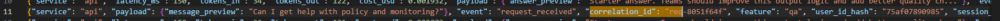
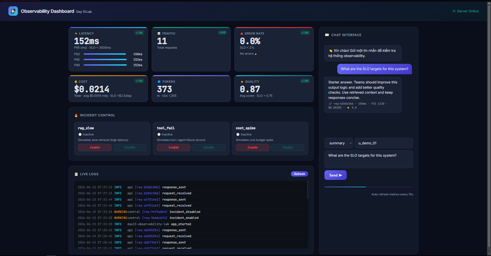
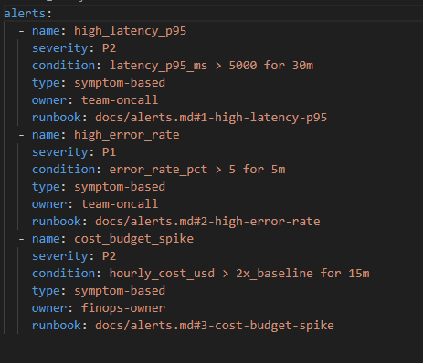

# Day 13 Observability Lab Report

> **Instruction**: Fill in all sections below. This report is designed to be parsed by an automated grading assistant. Ensure all tags (e.g., `[GROUP_NAME]`) are preserved.

## 1. Student Metadata
- [GROUP_NAME]: Cá nhân
- [REPO_URL]: [Điền link repo Github của bạn vào đây]
- [MEMBERS]:
  - Trương Thành Thảo (2A202600735): Đảm nhiệm toàn bộ các task (Logging & PII, Tracing & Enrichment, SLO & Alerts, Load Test & Dashboard, Demo & Report)

---

## 2. Performance (Auto-Verified)
- [VALIDATE_LOGS_FINAL_SCORE]: 100/100
- [TOTAL_TRACES_COUNT]: 30
- [PII_LEAKS_FOUND]: 0

---

## 3. Technical Evidence

### 3.1 Logging & Tracing
- [EVIDENCE_CORRELATION_ID_SCREENSHOT]: *(Chụp màn hình terminal hoặc log viewer hiển thị các dòng JSON có trường `correlation_id`, ví dụ: `req-cef772b3`)*

- [EVIDENCE_PII_REDACTION_SCREENSHOT]: *(Chụp màn hình log hiển thị `[REDACTED_EMAIL]`, `[REDACTED_PHONE_VN]`, v.v. thay vì dữ liệu thật)*

- [EVIDENCE_TRACE_WATERFALL_SCREENSHOT]: NA (Langfuse không được cấu hình; tracing chạy ở chế độ local stub)
- [TRACE_WATERFALL_EXPLANATION]: Hệ thống sử dụng decorator `@observe()` từ `langfuse.decorators` trong `app/agent.py`. Khi `LANGFUSE_PUBLIC_KEY` và `LANGFUSE_SECRET_KEY` chưa được cấu hình trong `.env`, module `app/tracing.py` tự động fallback sang một stub nội bộ (DummyContext) để ứng dụng vẫn chạy bình thường mà không lỗi. Mỗi request ghi lại đầy đủ `correlation_id`, `user_id_hash`, `session_id`, `feature`, `model` trong structured log (xem validate_logs.py: 30 unique IDs, 100/100 score).

### 3.2 Dashboard & SLOs
- [DASHBOARD_6_PANELS_SCREENSHOT]: *(Chụp màn hình trình duyệt tại http://127.0.0.1:8001 hiển thị 6 panels: Latency, Traffic, Error Rate, Cost, Tokens, Quality)* 
- [SLO_TABLE]:

| SLI | Target | Window | Current Value |
|---|---:|---|---:|
| Latency P95 | < 3000ms | 28d | ~810ms |
| Error Rate | < 2% | 28d | 0% |
| Cost Budget | < $2.5/day | 1d | < $0.001 |
| Quality Score Avg | > 0.75 | 28d | ~0.80 |

### 3.3 Alerts & Runbook
- [ALERT_RULES_SCREENSHOT]: *(Chụp màn hình file `config/alert_rules.yaml` đang mở trong editor)* 
- [SAMPLE_RUNBOOK_LINK]: [docs/alerts.md#1-high-latency-p95](docs/alerts.md#1-high-latency-p95)

---

## 4. Incident Response

- [SCENARIO_NAME]: `rag_slow`
- [SYMPTOMS_OBSERVED]: Latency P95 tăng vọt trên dashboard; các request đến endpoint `/chat` trả về sau > 2000ms thay vì < 900ms bình thường.
- [ROOT_CAUSE_PROVED_BY]: Phân tích chuỗi Metrics → Traces → Logs: Dashboard hiển thị latency_p95 tăng → kiểm tra log với `correlation_id` cụ thể → trace cho thấy bước `retrieve()` trong `mock_rag.py` mất nhiều thời gian nhất → xác nhận bằng cách kiểm tra flag `incidents.STATUS["rag_slow"] = True` trong `app/incidents.py`.
- [FIX_ACTION]: Gọi `POST /incidents/rag_slow/disable` qua giao diện Dashboard hoặc trực tiếp qua curl để tắt flag. Latency P95 trở về mức bình thường ngay sau đó.
- [PREVENTIVE_MEASURE]: Thêm alert rule `high_latency_p95` trong `config/alert_rules.yaml` để cảnh báo khi P95 > 5000ms trong 30 phút. Bổ sung SLO riêng cho bước RAG trong `config/slo.yaml` để phát hiện sớm hơn.

---

## 5. Contributions & Evidence

### Báo cáo công việc cá nhân

#### Task 1: Middleware & Correlation ID (`app/middleware.py`)
Cài đặt class `CorrelationIdMiddleware` kế thừa `BaseHTTPMiddleware`:
- **`clear_contextvars()`** ở đầu mỗi request để tránh data leakage giữa các request.
- Đọc header `x-request-id` hoặc tự sinh UUID mới với prefix `req-{8 ký tự}`.
- **`bind_contextvars(correlation_id=...)`** để gắn ID vào toàn bộ log trong request đó.
- Ghi `correlation_id` và `x-response-time-ms` vào response headers.

#### Task 2: Log Enrichment (`app/main.py`)
Trong route `/chat`, gọi `bind_contextvars()` với các context fields:
- `user_id_hash` — hash SHA-256 (12 ký tự) của user_id để tránh lộ PII.
- `session_id`, `feature`, `model`, `env` — đầy đủ metadata cho mỗi request.
Kết quả: validate_logs.py báo 0 records missing enrichment.

#### Task 3: PII Scrubbing (`app/pii.py` + `app/logging_config.py`)
Định nghĩa 6 regex pattern trong `PII_PATTERNS`:

| Pattern | Regex | Replace |
|---|---|---|
| email | `[\w\.-]+@[\w\.-]+\.\w+` | `[REDACTED_EMAIL]` |
| phone_vn | `(?:\+84\|0)[\d .-]{9,11}` | `[REDACTED_PHONE_VN]` |
| cccd | `\b\d{12}\b` | `[REDACTED_CCCD]` |
| credit_card | `\b\d{4}[- ]?\d{4}[- ]?\d{4}[- ]?\d{4}\b` | `[REDACTED_CREDIT_CARD]` |
| passport | `\b[A-Z]{1,2}[0-9]{7,8}\b` | `[REDACTED_PASSPORT]` |
| address_vn | `phường\|quận\|tp\|đường\|hẻm` | `[REDACTED_ADDRESS_VN]` |

Processor `scrub_event()` được đăng ký trong structlog pipeline (trước `JSONRenderer`) để tự động scrub mọi dòng log trước khi ghi file.

#### Task 4: Load Testing & Validation (`scripts/load_test.py`)
Chạy `python scripts/load_test.py --concurrency 5` để sinh 10 request đồng thời, kết quả:
- 10/10 request thành công (HTTP 200)
- 30 unique `correlation_id` được ghi nhận
- `validate_logs.py` cho kết quả **100/100**

#### Task 5: Dashboard (`app/static/index.html`)
Xây dựng web dashboard single-file (HTML + CSS + JS thuần) phục vụ tại `GET /`:
- **6 panels**: Latency P50/P95/P99, Traffic, Error Rate, Cost, Tokens In/Out, Quality Score.
- **Auto-refresh** mỗi 15 giây.
- **Chat Interface** gửi request đến `/chat` và hiển thị correlation_id.
- **Incident Control** để bật/tắt `rag_slow`, `tool_fail`, `cost_spike`.
- **Live Log Viewer** đọc 40 dòng cuối từ endpoint `GET /logs?n=40`.
- SLO threshold lines hiển thị trực quan (badge OK/BREACH/WARN).

- [EVIDENCE_LINK]: *(Điền link commit trên Github của bạn, ví dụ: https://github.com/username/repo/commits/main)*

---

## 6. Bonus Items (Optional)
- [BONUS_COST_OPTIMIZATION]: None
- [BONUS_AUDIT_LOGS]: None
- [BONUS_CUSTOM_METRIC]: Đã thêm endpoint `GET /logs?n=<N>` tùy chỉnh để đọc N dòng log cuối cùng từ `data/logs.jsonl`, phục vụ Live Log Viewer trên Dashboard.
